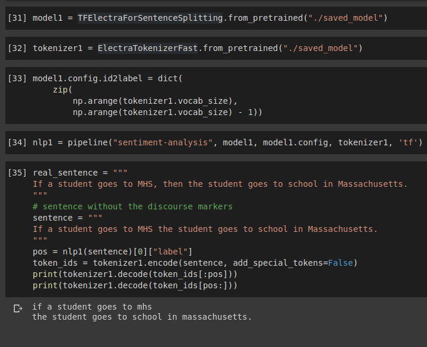

# Discourse based sentence splitter
Fine tuning ELECTRA to break sentences into two parts when the discourse marker is missing

## Problem
 - Being able to predict discourse in a sentence based on discourse markers is quite useful for many NLP task
 - Although, there are some discourse markers which get commonly skipped, `then` and `,` are good examples
 - Some real-world scenarios
   - In a chat people can naturally skip it as its not a formal typing environment
   - A speech-to-text software that doesn't translate verbal cues, like pauses, into commas
   
## Solution
 - Despite the absence of those discourse markers, the parts before and after the discourse marker depict recognizable grammar syntax
 - A pre-trained Language Model can be fine tuned to learn recognizing the start of a discourse in a sentence
 - This repository shows fine-tuning of ELECTRA, which is an LM exactly like BERT trained with a novel procedure that resembles GANs but does not really use adversarial training. The advantage that this adds is that the model uses significantly less memory and compute power as compared to the other comparable pre-trained LMs.
 
## Training details
 - Trained on `Google Colab` with 16GB of GPU available
 - `ELECTRA-base` model with 110M parameters was used
 - Used batch size of `32` but I haven't tried bigger ones to see if 16GB would still be enough
 - Fine-tuning for 2 epochs took about an hour
 
## Results
 - With little-to-no effort on hyperparameter tuning, fine tuning the model for 2 epochs gets to a `test accuracy of 91.8%` while `training accuracy is 95.4%`
 - Check the [notebook](https://github.com/pavanchhatpar/sentence-splitter/blob/master/Sentence_splitting_model.ipynb) or  for more details

## TODOs
 - Make the pretrained model available probably via Hugging Face's own model upload facility
 - Try a custom metric that uses distance of predicted discourse position from the actual one, that should be able explain the error more meaningfully
 - Modularizing the notebook to pull out the Model class as a package
 
## References & Acknowledgements
 - [ELECTRA: Pre-training Text Encoders as Discriminators Rather Than Generators](https://arxiv.org/abs/2003.10555)
 - `Hugging Face 🤗 Transformers` library for the pretrained ELECTRA model and their extremely lucid API
 - `Google Colaboratory` for providing the free GPU environment
 - [Mining Discourse Markers for Unsupervised Sentence Representation Learning](https://arxiv.org/abs/1903.11850) for providing the dataset
